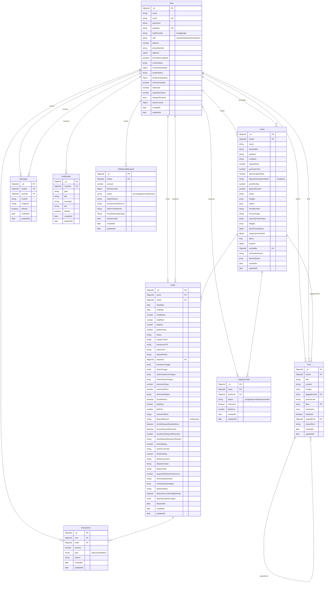

# ERD & Use Case Diagrams

## 1. ERD (Entity-Relationship Diagram)

## 2. Full System Use Case Diagram (All Roles)

Copy nguyên block này vào https://mermaid.live/:

```mermaid
graph TD
    subgraph Renter_UC["<<Renter>>"]
        R["Renter"] --> R_Auth["Authentication"]
        R --> R_Profile["Quản lý hồ sơ"]
        R --> R_EKYC["Xác thực eKYC"]
        R --> R1["Tìm kiếm tài sản"]
        R --> R2["Đặt thuê"]
        R --> R3["Thanh toán VNPay"]
        R --> R4["Nhận hàng OTP"]
        R --> R5["Trả hàng OTP"]
        R --> R6["Gia hạn"]
        R --> R7["Đánh giá"]
        R --> R8["Khiếu nại (Refuse)"]
        R --> R9["Phản hồi khiếu nại"]
        R --> R10["Nhắn tin"]
        R --> R11["Xem bài đăng"]
        R --> R12["Like/Comment"]
        subgraph R_Auth_Group["Authentication"]
            R_Auth --> R_Reg["Đăng ký"]
            R_Auth --> R_Login["Đăng nhập"]
            R_Auth --> R_Google["Google Login"]
        end
    end

    subgraph Lender_UC["<<Lender>>"]
        L["Lender"] --> L_Auth["Authentication"]
        L --> L_Profile["Quản lý hồ sơ"]
        L --> L_EKYC["eKYC + Bank Account"]
        L --> L_Asset["Đăng tài sản"]
        L --> L_Order["Xử lý đơn đặt"]
        L --> L_Handover["Bàn giao OTP"]
        L --> L_Return["Nhận lại OTP"]
        L --> L_Damage["Báo hư hỏng"]
        L --> L_Extend["Duyệt gia hạn"]
        L --> L_Wallet["Ví điện tử"]
        L --> L_Withdraw["Rút tiền"]
        L --> L_Rate["Đánh giá Renter"]
        L --> L_Chat["Nhắn tin"]
        L --> L_Post["Đăng bài cộng đồng"]
        subgraph L_Asset_Group["Quản lý tài sản"]
            L_Asset --> L_Create["Tạo mới"]
            L_Asset --> L_Update["Sửa"]
            L_Asset --> L_Delete["Xóa"]
        end
        subgraph L_Wallet_Group["Ví"]
            L_Wallet --> L_Bal["Xem số dư"]
            L_Wallet --> L_Txn["Lịch sử giao dịch"]
        end
        subgraph L_Withdraw_Group["Rút tiền"]
            L_Withdraw --> L_Req["Gửi yêu cầu"]
            L_Withdraw --> L_Hist["Xem lịch sử"]
        end
    end

    subgraph Inspector_UC["<<Inspector>>"]
        I["Inspector"] --> I_Auth["Authentication"]
        I --> I_Tasks["Quản lý task"]
        I --> I_Inspect["Kiểm định"]
        I --> I_History["Xem lịch sử"]
        subgraph I_Tasks_Group["Tasks"]
            I_Tasks --> I_View["Xem danh sách"]
            I_Tasks --> I_Accept["Nhận task"]
        end
        subgraph I_Inspect_Group["Kiểm định"]
            I_Inspect --> I_OnSite["Kiểm tra thực địa"]
            I_Inspect --> I_Result["Gửi kết quả + ký số"]
        end
    end

    subgraph Admin_UC["<<Admin>>"]
        AD["Admin"] --> AD_Auth["Authentication"]
        AD --> AD_Stats["Xem thống kê"]
        AD --> AD_User["Quản lý người dùng"]
        AD --> AD_EKYC["Duyệt eKYC"]
        AD --> AD_Asset["Duyệt tài sản"]
        AD --> AD_Order["Quản lý đơn hàng"]
        AD --> AD_Dispute["Xử lý khiếu nại"]
        AD --> AD_Withdraw["Duyệt rút tiền"]
        subgraph AD_EKYC_Group["Duyệt eKYC"]
            AD_EKYC --> AD_AppKYC["Duyệt"]
            AD_EKYC --> AD_RejKYC["Từ chối"]
        end
        subgraph AD_Dispute_Group["Xử lý khiếu nại"]
            AD_Dispute --> AD_View["Xem chi tiết"]
            AD_Dispute --> AD_Evid["Xem bằng chứng"]
            AD_Dispute --> AD_Ver["Phán quyết"]
            AD_Dispute --> AD_Dist["Phân bổ cọc"]
        end
        subgraph AD_Withdraw_Group["Duyệt rút tiền"]
            AD_Withdraw --> AD_AppW["Xác nhận đã chuyển"]
            AD_Withdraw --> AD_RejW["Từ chối"]
        end
    end

    R2 --> L_Order
    R4 --> L_Handover
    R5 --> L_Return
    R6 --> L_Extend
    R8 --> L_Damage
    R9 --> AD_Dispute
```

> **Các diagram riêng lẻ (nếu cần):** Copy từng phần dưới đây.
