# Đặc Tả Nghiệp Vụ & Chức Năng Theo Từng Vai Trò (Roles & Features)
## Dự án: Nền tảng Thuê Thiết bị P2P (Tech & Camping Rental Platform)

Tài liệu này tổng hợp chi tiết toàn bộ nghiệp vụ cốt lõi, quy trình vận hành và danh sách các API Endpoint tương ứng được phân chia cụ thể cho từng vai trò (`role`) trong hệ thống.

---

## 1. RENTER (Người Đi Thuê)
Renter là vai trò mặc định của mọi tài khoản sau khi đăng ký hoặc đăng nhập thông qua Google. Renter có nhu cầu tìm kiếm và thuê các thiết bị công nghệ hoặc dã ngoại có trên hệ thống.

### 1.1. Nghiệp Vụ Cốt Lõi
* **Quản lý thông tin**: Cập nhật thông tin cá nhân (SĐT, Địa chỉ kèm tọa độ định vị GPS) trước khi bắt đầu thuê đồ.
* **Đăng ký Lender**: Gửi hồ sơ eKYC (bao gồm ảnh chân dung, ảnh CCCD mặt trước/sau và thông tin tài khoản ngân hàng) để yêu cầu nâng cấp tài khoản lên quyền Lender.
* **Quy trình thuê đồ**: 
  1. Tìm kiếm và lọc thiết bị đã được kiểm duyệt (Ưu tiên sắp xếp theo khoảng cách GPS từ gần đến xa).
  2. Tạo đơn thuê đồ và thanh toán trực tuyến (bao gồm Tiền thuê + Tiền cọc thiết bị) thông qua cổng **VNPay Sandbox**.
  3. Nhận mã OTP bàn giao đồ (`handoverOTP`) và OTP trả đồ (`returnOTP`).
  4. Gặp mặt Lender, đưa mã `handoverOTP` cho Lender nhập để xác nhận đã nhận đồ.
  5. Sau khi dùng xong, đưa mã `returnOTP` cho Lender nhập để xác nhận hoàn trả đồ, nhận lại tiền cọc vào ví số dư.
  6. **Khiếu nại/Tranh chấp**: Trong quá trình thuê, nếu có sự cố hỏng hóc hoặc bất đồng, Renter có quyền gửi yêu cầu tranh chấp (`disputed`) kèm ghi chú lên hệ thống để chờ Admin/Inspector đứng ra phân định trọng tài.

### 1.2. Danh Sách API Endpoints Renter
| Phương thức | API Endpoint | Mô tả chức năng |
| :--- | :--- | :--- |
| `POST` | `/api/auth/register` | Đăng ký tài khoản mới (mặc định Renter) |
| `POST` | `/api/auth/login` | Đăng nhập tài khoản |
| `GET` | `/api/auth/google/callback` | Đăng nhập/Liên kết tài khoản qua Google OAuth2 |
| `PUT` | `/api/auth/complete-profile` | Hoàn thiện SĐT & Địa chỉ định vị (Bắt buộc trước khi thuê) |
| `POST` | `/api/auth/lender-onboarding` | Nộp hồ sơ eKYC xin nâng cấp lên Lender |
| `GET` | `/api/auth/balance` | Xem số dư ví tiền của Renter |
| `POST` | `/api/auth/withdraw` | Gửi yêu cầu rút tiền từ số dư ví về tài khoản ngân hàng |
| `GET` | `/api/assets` | Xem danh sách thiết bị công khai (sắp xếp theo khoảng cách GPS) |
| `POST` | `/api/orders` | Tạo đơn hàng mới & lấy URL thanh toán VNPay |
| `PUT` | `/api/orders/:id/dispute` | Gửi khiếu nại tranh chấp đơn hàng |

---

## 2. LENDER (Người Cho Thuê)
Lender là Renter đã được Admin xác thực hồ sơ eKYC thành công. Lender có tài sản/thiết bị nhàn rỗi muốn đăng tải lên sàn để cho thuê kiếm thêm thu nhập.

### 2.1. Nghiệp Vụ Cốt Lõi
* **Quản lý thiết bị**: Đăng tải thiết bị lên sàn (bao gồm tên, mô tả, danh mục, hình ảnh, video, tiền cọc, giá thuê/ngày và tọa độ vị trí GPS của thiết bị).
  * Thiết bị sau khi đăng sẽ tự động chuyển sang trạng thái chờ duyệt `pending_approval` để chờ Inspector kiểm định.
* **Xác nhận giao/nhận đồ**:
  * **Bàn giao đồ**: Gặp Renter, yêu cầu Renter đọc mã `handoverOTP`, nhập vào hệ thống để xác nhận bàn giao đồ. Đơn hàng chuyển sang trạng thái `active` (đang thuê).
  * **Nhận lại đồ**: Nhận lại đồ từ Renter, yêu cầu Renter đọc mã `returnOTP`, nhập vào hệ thống để xác nhận hoàn tất thuê đồ. Đơn hàng chuyển sang `completed` và hệ thống tự động quyết toán tiền.
* **Quản lý dòng tiền ví (Wallet Flow)**:
  * Khi đơn hàng hoàn thành thành công: **90% tiền thuê đồ** được giải ngân ngay lập tức vào số dư ví của Lender. **10% tiền thuê** được trích lại làm phí vận hành hệ thống (Platform Fee).
  * Lender có thể tạo lệnh rút tiền bất kỳ lúc nào. Số tiền yêu cầu rút sẽ bị đóng băng ngay lập tức. Sau khi Admin phê duyệt và chuyển khoản ngân hàng, giao dịch thành công. Nếu Admin từ chối, tiền đóng băng tự động hoàn trả lại ví của Lender.

### 2.2. Danh Sách API Endpoints Lender
| Phương thức | API Endpoint | Mô tả chức năng |
| :--- | :--- | :--- |
| `PUT` | `/api/auth/switch-role` | Chuyển đổi qua lại giữa vai trò Renter và Lender |
| `GET` | `/api/auth/balance` | Xem số dư ví tích lũy của Lender |
| `POST` | `/api/auth/withdraw` | Tạo yêu cầu rút tiền về tài khoản ngân hàng |
| `POST` | `/api/assets` | Đăng ký tài sản/thiết bị mới (Tự động phân bổ Inspector kiểm duyệt) |
| `PUT` | `/api/orders/:id/handover` | Nhập OTP xác nhận đã bàn giao đồ cho Renter |
| `PUT` | `/api/orders/:id/return` | Nhập OTP xác nhận đã nhận lại đồ & quyết toán dòng tiền |
| `PUT` | `/api/orders/:id/dispute` | Gửi khiếu nại tranh chấp đơn hàng |

---

## 3. INSPECTOR (Kiểm Định Viên)
Kiểm định viên là nhân sự của hệ thống có nhiệm vụ kiểm duyệt chất lượng, nguồn gốc của các thiết bị do Lender đăng ký trước khi hiển thị công khai lên sàn.

### 3.1. Nghiệp Vụ Cốt Lõi
* **Phân bổ nhiệm vụ thông minh**: Khi Lender đăng thiết bị, hệ thống tự động phân bổ nhiệm vụ cho Inspector:
  * **Thiết bị giá trị nhỏ (< 2.000.000 ₫)**: Phân bổ kiểm duyệt **từ xa (Online)** qua ảnh và video.
  * **Thiết bị giá trị cao (≥ 2.000.000 ₫)**: Phân bổ kiểm duyệt **trực tiếp (Offline)** tận nơi cho Inspector **gần vị trí thiết bị nhất** dựa trên thuật toán định vị Haversine.
* **Xác thực thiết bị**: Inspector xem danh sách các thiết bị được phân bổ chờ duyệt, kiểm tra thông tin và đưa ra quyết định:
  * `verified`: Thiết bị được duyệt và hiển thị công khai trên sàn cho Renter thuê.
  * `rejected`: Từ chối duyệt kèm ghi chú cụ thể.
  * `unavailable`: Tạm dừng hiển thị thiết bị.
* **Giải quyết tranh chấp**: Inspector có quyền tham gia làm trọng tài giải quyết khiếu nại của đơn hàng.

### 3.2. Danh Sách API Endpoints Inspector
| Phương thức | API Endpoint | Mô tả chức năng |
| :--- | :--- | :--- |
| `GET` | `/api/assets/pending` | Xem danh sách thiết bị đang chờ kiểm duyệt |
| `PUT` | `/api/assets/:id/verify` | Phê duyệt/Từ chối duyệt thiết bị cho thuê |
| `PUT` | `/api/orders/:id/resolve-dispute` | Tham gia giải quyết tranh chấp đơn hàng |

---

## 4. ADMIN (Quản Trị Viên)
Quản trị viên là vai trò cao cấp nhất, nắm quyền kiểm soát toàn bộ hoạt động kinh doanh, tính an toàn bảo mật và luồng tài chính dòng tiền trên nền tảng.

### 4.1. Nghiệp Vụ Cốt Lõi
* **Xác thực eKYC Lender**: Xem chi tiết các đơn xin nâng cấp lên Lender của Renter (Xem ảnh CCCD mặt trước/sau, ảnh Selfie đối chiếu). Phê duyệt để nâng cấp tài khoản hoặc từ chối kèm lý do.
* **Giải ngân rút tiền ví**: Xem các yêu cầu rút tiền của Lender. Admin thực hiện chuyển khoản thủ công bên ngoài, sau đó bấm phê duyệt giải ngân để hoàn tất giao dịch hoặc bấm từ chối để tự động hoàn tiền đóng băng về ví cho Lender.
* **Quyết toán trọng tài tranh chấp (Trọng tài tối cao)**:
  * Khi có tranh chấp hỏng hóc đồ giữa Renter và Lender, Admin đứng ra phán quyết và giải ngân dòng tiền (bao gồm tổng quỹ tiền thuê + tiền đặt cọc đang giữ của đơn hàng):
  * Nhập chính xác số tiền hoàn trả cho Renter (`renterRefund`) và đền bù cho Lender (`lenderCompensation`). Hệ thống tự động phân bổ trực tiếp số tiền này vào ví số dư của hai bên và đóng đơn hàng.
* **Quản trị hệ thống nâng cao**:
  * Theo dõi thống kê tổng doanh thu, doanh số phí nền tảng thu được, số lượng người dùng và thiết bị theo thời gian thực.
  * Tìm kiếm, lọc danh sách thành viên, thiết bị, đơn hàng.
  * Bổ nhiệm quyền hạn (ví dụ: thăng chức một user thành Inspector).
  * Khóa (`ban`) / Mở khóa (`unban`) tài khoản người dùng vi phạm quy định (Tài khoản bị khóa sẽ lập tức bị đá ra khỏi hệ thống và không thể đăng nhập).

### 4.2. Danh Sách API Endpoints Admin
| Phương thức | API Endpoint | Mô tả chức năng |
| :--- | :--- | :--- |
| `GET` | `/api/auth/lender-applications` | Xem danh sách hồ sơ đăng ký Lender chờ duyệt |
| `PUT` | `/api/auth/lender-applications/:id/verify` | Phê duyệt/Từ chối hồ sơ Lender eKYC |
| `GET` | `/api/auth/withdrawals` | Xem danh sách các yêu cầu rút tiền của Lender |
| `PUT` | `/api/auth/withdrawals/:id/verify` | Phê duyệt/Từ chối giải ngân tiền rút |
| `PUT` | `/api/orders/:id/settle` | Chủ động quyết toán thủ công đơn hàng đã trả đồ |
| `PUT` | `/api/orders/:id/resolve-dispute` | Trọng tài tối cao giải quyết tranh chấp đơn hàng |
| `GET` | `/api/admin/stats` | Xem thống kê số liệu tổng quan và cảnh báo công việc |
| `GET` | `/api/admin/users` | Tìm kiếm, quản lý và lọc danh sách thành viên |
| `PUT` | `/api/admin/users/:id/role` | Cập nhật vai trò thành viên (ví dụ thăng chức Inspector) |
| `PUT` | `/api/admin/users/:id/ban` | Khóa / Mở khóa tài khoản thành viên |
| `GET` | `/api/admin/assets` | Xem và lọc toàn bộ thiết bị trên hệ thống |
| `GET` | `/api/admin/orders` | Xem và lọc toàn bộ đơn hàng trên sàn |

---

## 5. BẢN ĐỒ DÒNG TIỀN VÀ QUỸ TIỀN NỀN TẢNG (FINANCIAL FLOW)

```mermaid
sequenceDiagram
    autonumber
    actor R as Renter
    actor L as Lender
    participant P as Platform (Quỹ tạm giữ)
    actor A as Admin (Trọng tài)

    R->>P: 1. Tạo đơn thuê & Thanh toán qua VNPay (Tiền thuê + Tiền cọc)
    Note over P: Đơn hàng ở trạng thái 'reserved'
    
    rect rgb(20, 30, 50)
        Note over R, L: Quá trình bàn giao & thuê đồ hoạt động
    end
    
    alt Trường hợp 1: Trả đồ thành công bình thường
        L->>P: 2. Nhập returnOTP xác nhận hoàn tất
        P->>R: 3a. Tự động hoàn 100% tiền đặt cọc về ví Renter
        P->>L: 3b. Giải ngân 90% tiền thuê về ví Lender
        P->>P: 3c. Thu giữ 10% tiền thuê làm Platform Fee
    else Trường hợp 2: Phát sinh tranh chấp (Disputed)
        R->>P: 2. Báo lỗi và tạo tranh chấp đơn hàng
        A->>A: 3. Admin/Inspector xem xét chứng cứ & phân chia tỷ lệ tiền
        A->>P: 4. Gọi API resolve-dispute
        P->>R: 5a. Giải ngân số tiền hoàn cọc/thuê (renterRefund) về ví Renter
        P->>L: 5b. Giải ngân số tiền đền bù (lenderCompensation) về ví Lender
    end

    rect rgb(15, 25, 45)
        Note over L: Lender rút tiền từ số dư ví về tài khoản ngân hàng
        L->>P: 6. Tạo lệnh rút tiền (Khấu trừ & đóng băng số dư ví Lender)
        A->>L: 7. Admin chuyển khoản ngân hàng thủ công bên ngoài
        A->>P: 8. Gọi API verify-withdrawal phê duyệt lệnh
        Note over P: Lệnh rút tiền thành công / Hoặc Hoàn lại ví nếu từ chối
    end
```

---

## 6. CÁC NGHIỆP VỤ NÂNG CAO & CHÍNH SÁCH BỔ SUNG (ADVANCED POLICIES)

Để tối ưu hóa lòng tin, tính pháp lý và giảm thiểu tối đa rủi ro tranh chấp tài sản trên sàn P2P, hệ thống tích hợp 6 chính sách nghiệp vụ nâng cao dưới đây:

### 6.1. Quy Trình Giao Nhận Kèm Minh Chứng Hình Ảnh (Inspection Photos)
* **Mô tả nghiệp vụ**: OTP chỉ xác nhận hai bên có gặp mặt thực tế. Để làm căn cứ trọng tài cho Admin khi xảy ra trầy xước, hỏng hóc, hệ thống bắt buộc chụp minh chứng:
  * **Khi Bàn Giao (Handover)**: Khi gọi API `PUT /api/orders/:id/handover`, Lender bắt buộc phải chụp và tải lên tối thiểu **3 - 5 ảnh chụp hiện trạng thiết bị** (các góc cạnh, tem niêm phong, màn hình đang bật hoạt động).
  * **Khi Trả Đồ (Return)**: Khi gọi API `PUT /api/orders/:id/return`, Lender tiếp tục chụp và tải lên **3 - 5 ảnh chụp hiện trạng lúc nhận lại**.
  * **Vai trò pháp lý**: Nếu Renter trả đồ bị lỗi hỏng sensor/móp méo và Lender khiếu nại (`disputed`), Admin sẽ so sánh ảnh Handover vs ảnh Return để làm bằng chứng pháp lý cao nhất đưa ra tỷ lệ đền bù chính xác.

### 6.2. Chính Sách Hủy Đơn & Phạt "Bùng Kèo" (Cancellation Policy)
Hạn chế tình trạng hủy đơn đột xuất gây tổn thất chuẩn bị cho các bên:
* **Renter Chủ Động Hủy Đơn**:
  * Hủy trước thời điểm giao nhận $\ge 24\text{ giờ}$: Hoàn trả **100% tiền thuê và 100% tiền cọc** về ví Renter (API `POST /api/orders/:id/cancel`).
  * Hủy sát giờ thuê $< 6\text{ giờ}$ hoặc không đến nhận: Hệ thống **phạt 30% tiền thuê** để đền bù chuẩn bị đồ cho Lender (chuyển thẳng 30% này vào ví Lender), phần còn lại (70% tiền thuê + 100% tiền cọc) hoàn lại ví Renter.
* **Lender Chủ Động Hủy Đơn**:
  * Lender đã nhận đơn đặt cọc nhưng đột xuất hủy hoặc không đến bàn giao đồ: Hệ thống áp dụng hình phạt **khấu trừ điểm uy tín** của Lender, đồng thời phạt **10% tiền thuê** trừ trực tiếp từ số dư ví Lender để đền bù trải nghiệm cho Renter.

### 6.3. Nghiệp Vụ Gia Hạn Thuê Tiện Lợi (Lease Extension)
* **Mô tả nghiệp vụ**: Khi đang thuê đồ và muốn dùng thêm ngày (do thời tiết, hỏng xe, thay đổi lịch trình,...), Renter có thể xin gia hạn.
* **Luồng xử lý**:
  1. Renter gửi yêu cầu gia hạn kèm số ngày mong muốn qua API `POST /api/orders/:id/extend`.
  2. Lender nhận được yêu cầu gia hạn, có quyền Phê duyệt hoặc Từ chối tùy thuộc vào lịch thuê của khách tiếp theo.
  3. Nếu Lender đồng ý, Renter tiến hành thanh toán bổ sung tiền thuê số ngày gia hạn qua cổng thanh toán VNPay Sandbox.
  4. Hệ thống cập nhật thời gian trả đồ mới (`endDate`) trên đơn hàng. Mã OTP trả đồ (`returnOTP`) cũ vẫn được bảo toàn hiệu lực cho đến ngày trả đồ mới.

### 6.4. Hệ Thống Đánh Giá Chéo & Điểm Uy Tín (Rating & Reputation)
Lòng tin là cốt lõi của nền tảng chia sẻ thiết bị P2P:
* **Nghiệp vụ Đánh giá**: Sau khi đơn hoàn tất thành công (`completed`), cả Renter và Lender đều phải đánh giá đối phương từ **1 đến 5 sao** kèm bình luận chi tiết qua API `POST /api/orders/:id/rate`.
* **Ứng dụng điểm Uy tín**:
  * **Lender uy tín cao**: Thiết bị đăng tải sẽ được thuật toán Inspector ưu tiên duyệt nhanh hơn (Duyệt nhanh hoặc phân bổ Inspector nhanh nhất).
  * **Renter uy tín cao**: Được hệ thống giảm tỷ lệ tiền cọc (Trust-based deposit discount) từ 10% - 30% giá trị cọc gốc của thiết bị (giảm bớt rào cản tài chính khi thuê thiết bị đắt tiền).

### 6.5. Quản Lý Trạng Trạng Thái "Bảo Trì/Bận" Của Thiết Bị (Maintenance State)
* **Mô tả nghiệp vụ**: Tránh tình trạng Renter đặt đơn thuê nhưng Lender đang đi du lịch hoặc thiết bị đang được bảo dưỡng/hỏng hóc chưa sửa kịp.
* **Luồng xử lý**: Lender có nút chuyển nhanh trạng thái thiết bị sang **"Tạm ngưng cho thuê"** hoặc **"Đang sửa chữa/Bảo trì"** thông qua API `PUT /api/assets/:id/status`. Thiết bị ở trạng thái này sẽ lập tức ẩn khỏi trang tìm kiếm công khai của Renter, tránh gây trải nghiệm đặt đồ rồi bị hủy.

### 6.6. Tự Động Tạo Hợp Đồng Thuê Điện Tử (E-Contract Generation)
* **Mô tả nghiệp vụ**: Đảm bảo an toàn pháp lý tuyệt đối khi cho thuê các dòng máy quay, Flycam trị giá 50 - 70 triệu VNĐ trước luật pháp đời thực.
* **Cơ chế hoạt động**:
  * Ngay khi Renter thực hiện đặt cọc thanh toán đơn hàng VNPay thành công, hệ thống tự động trích xuất dữ liệu eKYC của hai bên (Họ tên, SĐT, Số CCCD, địa chỉ định vị) và thông tin thiết bị để **tự động khởi tạo file PDF Hợp đồng thuê tài sản điện tử**.
  * File hợp đồng được ký số đóng dấu xác thực của nền tảng VeloX, hiển thị trực tiếp trên app cho 2 bên cùng tải xuống hoặc xem trực tiếp thông qua API `GET /api/orders/:id/contract`.
**** Tính năng cần bổ sung : 
--tìm đồ theo nhu cầu cắm trại như : đi 3ng thì dùng lều gì .... (đi bộ 1-2 ngày )
-- giá tiền cọc, cọc theo giá sản phẩm vào từng thời điểm vd : món đồ đã lâu , mới thì cọc giá khác
--tạo personal page cho renter để đăng bài PR sản phẩm,có thể tag sản phẩm của lender vào
--tích hợp AI vào