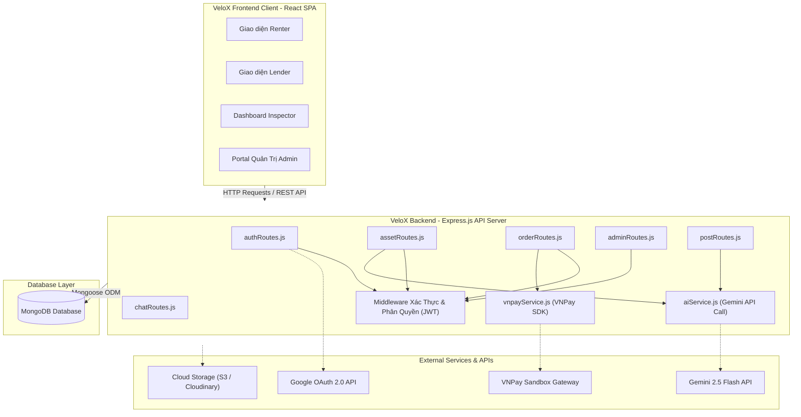
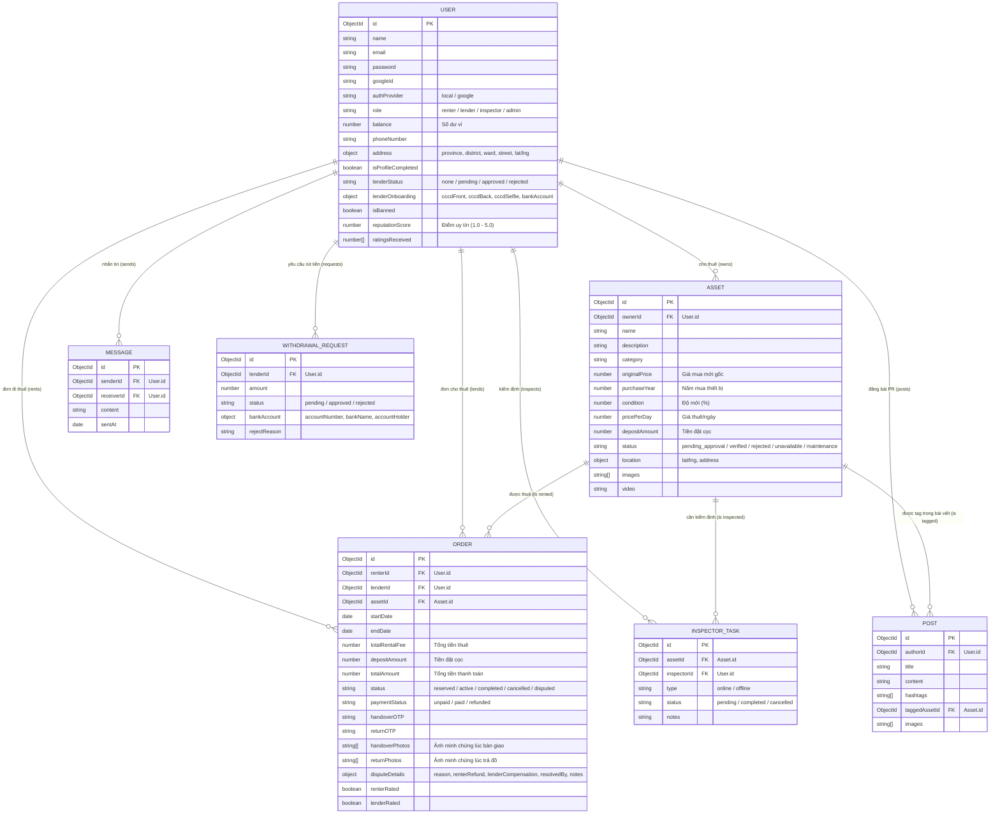
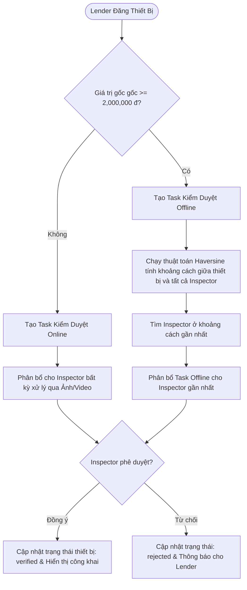

# Kiến Trúc Hệ Thống (System Architecture)
## Dự án: Nền tảng Thuê Thiết bị P2P (Tech & Camping Rental Platform)

Tài liệu này đặc tả chi tiết kiến trúc kỹ thuật của hệ thống, bao gồm các thành phần công nghệ, mô hình thực thể cơ sở dữ liệu (ERD), và sơ đồ luồng nghiệp vụ chính của nền tảng VeloX.

---

## 1. Tổng Quan Kiến Trúc Hệ Thống (System Overview)

Hệ thống được thiết kế theo mô hình **Client-Server** chuẩn:
* **Frontend (Client):** Sử dụng Single Page Application (SPA) phát triển bằng React (Vite) và Tailwind CSS để tạo giao diện phản hồi nhanh và mượt mà cho người dùng (Renter, Lender, Inspector, Admin).
* **Backend (Server):** Xây dựng trên Express.js (Node.js) cung cấp RESTful APIs, tích hợp xác thực JWT phân quyền chặt chẽ.
* **Database Layer:** Sử dụng MongoDB (Mongoose ODM) để lưu trữ phi cấu trúc, dễ dàng mở rộng và tối ưu hóa truy vấn GPS (Geospatial query).
* **External Services:** Liên kết với VNPay Sandbox (Thanh toán trực tuyến), Gemini 2.5 Flash API (Tư vấn AI & định giá tự động), Google OAuth 2.0 (Đăng nhập nhanh), và các hệ thống lưu trữ ảnh.

---

## 2. Mô Hình Thực Thể Cơ Sở Dữ Liệu (Database ERD)

Dưới đây là cấu trúc thiết kế Schema MongoDB thể hiện mối quan hệ giữa các thực thể chính trong hệ thống:

---

## 3. Các Luồng Nghiệp Vụ Đặc Thù (Core Workflows)

### 3.1. Luồng Phân Bổ Inspector & Duyệt Thiết Bị (Smart Allocation)

Khi Lender đăng tải một thiết bị mới, hệ thống tự động phân loại hình thức kiểm định dựa trên giá trị gốc của thiết bị:
* **Thiết bị giá trị nhỏ (< 2,000,000 đ):** Tạo nhiệm vụ kiểm duyệt trực tuyến (Online) và phân phối ngẫu nhiên cho một Inspector rảnh.
* **Thiết bị giá trị cao ($\ge$ 2,000,000 đ):** Tạo nhiệm vụ kiểm duyệt tận nơi (Offline). Hệ thống sẽ tính khoảng cách địa lý (Haversine formula) từ vị trí thiết bị tới tọa độ của các Inspector đang hoạt động, sau đó tự động phân phối cho Inspector gần nhất.

### 3.2. Luồng Thanh Toán, Bàn Giao & Quyết Toán Đơn Hàng (Order & Financial Flow)

Quy trình thanh toán ký quỹ (Escrow) đảm bảo an toàn tài chính cho cả Renter và Lender:

```mermaid
sequenceDiagram
    autonumber
    actor R as Renter (Người Thuê)
    actor L as Lender (Chủ Đồ)
    participant P as Platform & Ví Tạm Giữ
    actor A as Admin (Trọng Tài)

    R->>P: 1. Tạo đơn hàng và thanh toán qua VNPay (Tiền thuê + Tiền cọc)
    Note over P: Đơn hàng ở trạng thái 'reserved'. Tiền cọc được khóa lại.
    
    rect rgb(30, 40, 60)
        Note over R, L: Gặp mặt trực tiếp để bàn giao
    end
    
    L->>P: 2. Nhập handoverOTP của Renter + Tải lên 3-5 ảnh hiện trạng bàn giao
    Note over P: Đơn hàng chuyển sang trạng thái 'active' (đang thuê)
    
    rect rgb(30, 40, 60)
        Note over R, L: Sử dụng thiết bị & trả đồ
    end

    L->>P: 3. Nhập returnOTP của Renter + Tải lên 3-5 ảnh hiện trạng trả đồ
    
    alt Không có tranh chấp phát sinh (Bình thường)
        P->>R: 4a. Tự động hoàn lại 100% tiền đặt cọc vào ví số dư của Renter
        P->>L: 4b. Giải ngân 90% tiền thuê vào ví của Lender
        P->>P: 4c. Thu giữ 10% tiền thuê làm phí nền tảng (Platform Fee)
        Note over P: Đơn hàng hoàn tất 'completed'
    else Renter trả đồ hỏng/Lender khiếu nại (Tranh chấp - Disputed)
        R->>P: 4. Báo cáo sự cố và tạo trạng thái tranh chấp 'disputed'
        A->>A: 5. Admin kiểm tra hình ảnh bàn giao so với hình ảnh hoàn trả
        A->>P: 6. Thực hiện phân chia trọng tài (resolve-dispute)
        P->>R: 7a. Trả lại renterRefund (tiền cọc còn lại sau đền bù) vào ví Renter
        P->>L: 7b. Chuyển lenderCompensation (tiền đền bù hỏng hóc) vào ví Lender
        Note over P: Đơn hàng đóng lại sau khi phân xử
    end
```

### 3.3. Tích Hợp AI Trí Tuệ Nhân Tạo (AI Features Flow)

Hệ thống tích hợp Gemini 2.5 Flash API cho 3 tính năng thông minh:
1. **AI Camping Consultant:** Phân tích nhu cầu cắm trại của khách (số người, số ngày, địa hình, ngân sách tối đa) để gợi ý danh sách trang bị cần thiết và tự động khớp (match) với các thiết bị đang có sẵn trong database.
2. **AI Deposit & Rental Calculator:** Hỗ trợ định giá tài sản tự động cho Lender dựa trên giá mua gốc, năm mua và độ mới (%) của thiết bị.
3. **AI PR Content Assistant:** Hỗ trợ Renter tự động soạn thảo bài viết đánh giá/PR sản phẩm có cảm xúc kèm hashtags để đăng lên trang cá nhân và tag sản phẩm của Lender.

---

## 4. Công Nghệ Sử Dụng (Tech Stack Summary)

| Tầng (Layer) | Công nghệ / Thư viện | Vai trò và Lý do sử dụng |
| :--- | :--- | :--- |
| **Frontend UI** | React 19, Tailwind CSS, Vite | Xây dựng giao diện phản hồi nhanh, tối ưu hóa tốc độ tải trang (Vite) và thiết kế giao diện hiện đại (Tailwind). |
| **State Management** | Redux Toolkit & React-Redux | Quản lý trạng thái ứng dụng đồng nhất (thông tin đăng nhập, ví tiền, giỏ hàng, thông báo). |
| **Backend Core** | Node.js, Express.js | Engine hiệu năng cao, cơ chế non-blocking I/O phù hợp cho các luồng xử lý thời gian thực. |
| **Database** | MongoDB & Mongoose ODM | Lưu trữ dữ liệu JSON-like linh hoạt, hỗ trợ tốt các truy vấn tìm kiếm theo GPS tọa độ (2dsphere index). |
| **AI Processing** | Gemini 2.5 Flash API | Nhận diện ngôn ngữ tự nhiên từ Renter để đề xuất đồ cắm trại, tự động hóa định giá khấu hao và hỗ trợ content PR. |
| **Payment Gateway** | VNPay Sandbox API | Đảm bảo luồng giao dịch thanh toán trực tuyến ký quỹ an toàn, hỗ trợ hoàn tiền tự động qua hệ thống ví. |
| **API Documentation** | Swagger-UI-Express | Tự động sinh tài liệu API trực quan tại `/api-docs` giúp các bên dễ dàng tích hợp và thử nghiệm. |
| **Security** | Helmet, Bcrypt, JWT | Bảo mật header HTTP, băm mật khẩu người dùng và phân quyền API theo Token JWT. |
