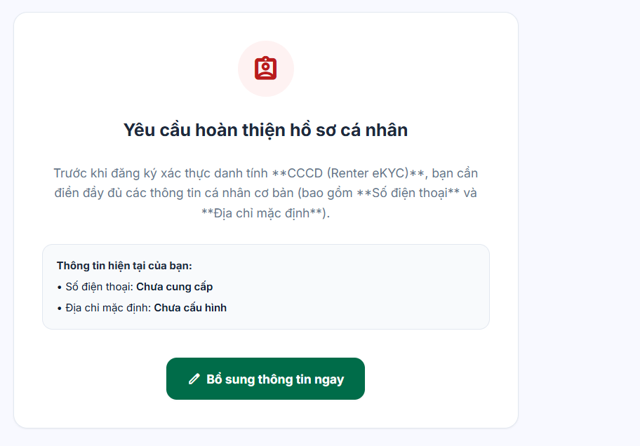
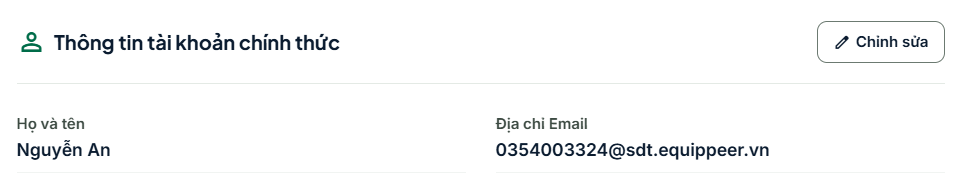
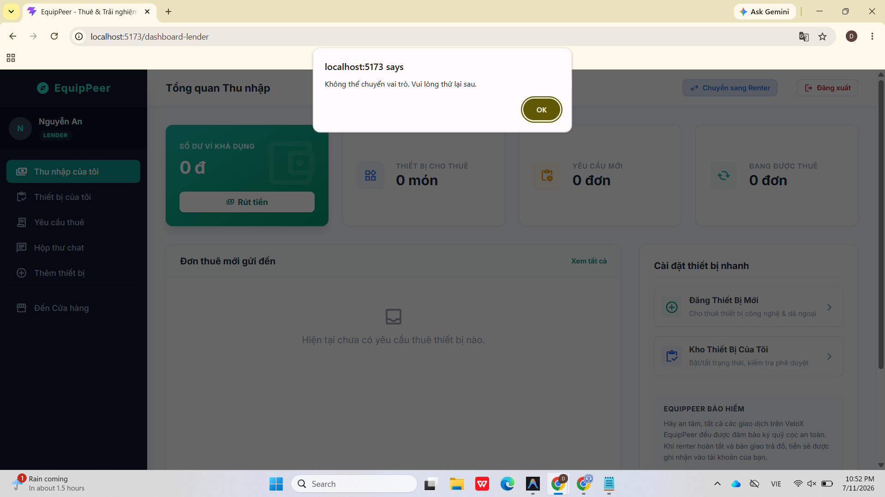
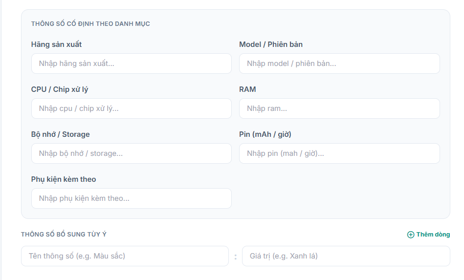
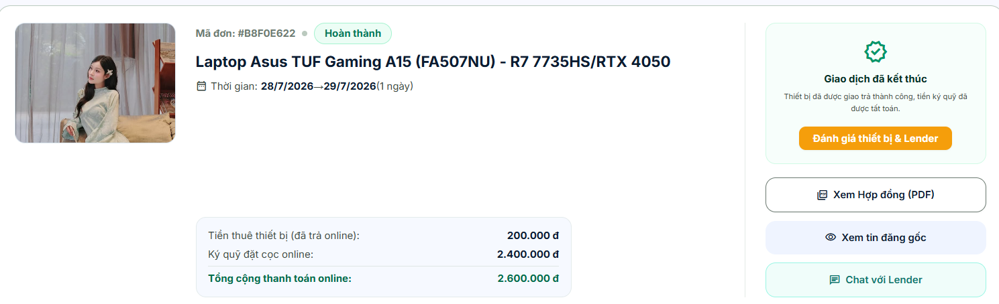
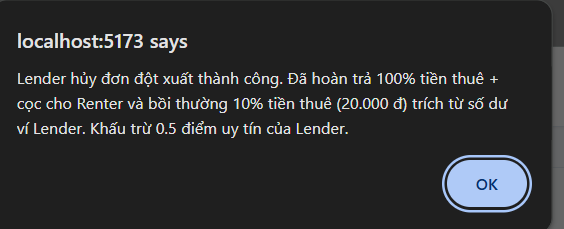

# Hướng Dẫn Kiểm Thử Toàn Bộ Nghiệp Vụ (P2P Camping Rental Platform)

Đây là checklist để bạn có thể tự kiểm thử toàn bộ các luồng nghiệp vụ của hệ thống. Hãy tích (`[x]`) vào các ô trống sau khi bạn đã test qua từng trường hợp.

## 1. Đăng ký, Đăng nhập và Xác thực (Authentication & eKYC)
- [x] **Đăng ký tài khoản mới**: Đăng ký thành công với email/SĐT chưa từng tồn tại trên hệ thống.
- [x] **Đăng nhập thành công**: Đăng nhập bằng tài khoản và mật khẩu đúng.
- [ x] **Đăng nhập thất bại**: Đăng nhập sai mật khẩu hoặc tài khoản chưa tồn tại, hệ thống báo lỗi rõ ràng.(lỗi invalid credential chưa báo lỗi rõ ràng cho user)
- [ x] **Xác thực eKYC (Thành công)**: Tải lên giấy tờ tùy thân hợp lệ, hệ thống duyệt và chuyển trạng thái tài khoản thành "Đã xác thực".
- [ x] **Xác thực eKYC (Thất bại)**: Tải lên ảnh mờ hoặc không hợp lệ, hệ thống từ chối và yêu cầu xác thực lại.
-[x] Xác thực khi gửi yêu cầu eKYC lần đầu đợi admin duyệt nhưng khi gửi vẫn hiện thông báo bắt  dù đã hoàn thiện hồ sơ \
-[x] Cập nhật thông tin ,khi đăng kí tk mới mà k dùng bằng gg thì sẽ cho 1 mail sẵn và tui muốn user dc quyền sửa mail này 
-[x] đăng kí trở thành lender đã dc duyệt thành công nhưng không thể chuyển đổi giữa 2 role  
## 2. Quản lý Tin cho thuê (Dành cho Chủ đồ / Lessor)
- [x] **Đăng tin mới**: Đăng thành công một sản phẩm/lều trại với đầy đủ tên, mô tả, hình ảnh, giá thuê và quy định.
- [x] **Cập nhật tin**: Thay đổi thông tin sản phẩm (giá, mô tả) thành công.sau khi vô phần cập nhật thông tin thì  các field trong ảnh bị mất tui muốn giữ im tất cả thôngg tin tui đã nhập (ĐÃ FIX: Dữ liệu form không còn bị mất khi vào Edit Asset).
- [ x] **Quản lý lịch bận**: Thiết lập các ngày không cho thuê (block dates) thành công. phần quản lí lịch bận .Tính năng này nên để lender tự tắt hay sau khi đã bàn giao đồ thành công thì thiết bị tự động block theo lịch đã đặt
- [x ] **Ẩn/Xóa tin**: Chuyển sản phẩm sang trạng thái ẩn, người dùng không tìm thấy trên hệ thống nữa.

## 3. Tìm kiếm và Xem sản phẩm (Dành cho Người thuê / Renter)
- [ ] **Tìm kiếm từ khóa**: Nhập tên sản phẩm để tìm kiếm và ra đúng kết quả.
- [ ] **Sử dụng bộ lọc**: Lọc sản phẩm theo khoảng giá, loại sản phẩm, đánh giá.
- [ ] **Xem chi tiết**: Hiển thị đúng thông tin mô tả, lịch trống, giá thuê, và thông tin của chủ đồ.

## 4. Luồng Đặt Thuê Thành Công (Happy Path Booking Flow)
- [ x] **Tạo yêu cầu thuê**: Renter chọn ngày thuê/ngày trả và gửi yêu cầu đặt đồ.
- [ x] **Lessor nhận yêu cầu**: Chủ đồ nhận được thông báo/tin nhắn về yêu cầu thuê mới.
- [ x] **Lessor phê duyệt**: Chủ đồ chấp nhận yêu cầu thuê.
- [x ] **Thanh toán (Cọc/Toàn bộ)**: Renter tiến hành thanh toán qua cổng thanh toán thành công. Trạng thái đơn đổi thành "Chờ bàn giao".
- [ x] **Bàn giao đồ**: Chủ đồ xác nhận đã giao đồ. Trạng thái đổi thành "Đang thuê".
- [ x] **Trả đồ**: Renter trả lại đồ. Chủ đồ xác nhận đã nhận lại đồ an toàn.
- [ x] **Hoàn thành và Đánh giá**: Đơn hàng hoàn tất. Hai bên đánh giá và để lại nhận xét cho nhau.

## 5. Kịch bản Hủy / Đặt không thành công (Cancellations)
- [ ] **Lessor từ chối**: Chủ đồ từ chối yêu cầu đặt đồ ban đầu -> Yêu cầu bị hủy, Renter nhận được thông báo.(sau khi lender từ chối , phía renter không có động thái nào khác thì 1 lúc sau  hệ thống đã hoàn tiền nhưng thông báo lại là đã thuê thành công)
- [ ] **Renter hủy trước khi duyệt**: Renter tự hủy yêu cầu khi chủ đồ chưa kịp duyệt -> Thành công( chưa có tính năng cho renter tự huyẻ khi đồ chưa duyệt )
- [x] **Renter hủy sau khi đã thanh toán (Hợp lệ)**: Renter hủy đơn trong khoảng thời gian cho phép (VD: trước 3 ngày) -> Hoàn trả tiền cọc/thanh toán theo đúng chính sách.
- [x] **Renter hủy sau khi đã thanh toán (Vi phạm)**: Renter hủy quá sát ngày nhận đồ -> Bị trừ phí hoặc mất tiền cọc.  
- [ ] **Thanh toán hết hạn**: Đơn đã được duyệt nhưng Renter không thanh toán trong thời gian quy định -> Đơn tự động chuyển sang trạng thái "Đã hủy".

## 6. Xử lý Sự cố & Khiếu nại (Disputes)
- [ ] **Trả đồ muộn (Late Return)**: Renter trả đồ sau ngày quy định -> Hệ thống hoặc chủ đồ tính thêm phí phạt.
- [ ] **Đồ bị hư hỏng / Mất mát (Lessor khiếu nại)**: Lúc nhận lại đồ, chủ đồ phát hiện hư hỏng -> Tạo khiếu nại, yêu cầu trừ tiền từ cọc của người thuê.
- [ ] **Đồ không đúng mô tả (Renter khiếu nại)**: Lúc nhận đồ, người thuê phát hiện đồ hỏng hoặc không đúng -> Tạo khiếu nại từ chối nhận đồ, yêu cầu hoàn tiền.
- [ ] **Admin can thiệp (Admin Resolution)**: Đăng nhập quyền Admin, xem xét bằng chứng của hai bên và đưa ra quyết định xử lý (hoàn tiền cho Renter hoặc trả bồi thường cho Lessor).

## 7. Nhắn tin và Thông báo (Messaging & Notifications)
- [ x] **Gửi tin nhắn**: Hai bên nhắn tin được cho nhau trong giao diện chi tiết đơn hoặc khung chat.
- [x ] **Kiểm tra thông báo**: Hệ thống báo Notification thời gian thực khi có thay đổi trạng thái đơn (duyệt, hủy, thanh toán thành công).
[issue] (ĐÃ FIX TOÀN BỘ)
-[x] khi tạo tài khoản thành công thì không thấy thông báo
-[x] khi tạo đơn thuê nhiều lúc bắt xác thực ekyc dù đã xác thực r
-
[cần giải đáp] (ĐÃ ĐƯỢC GIẢI ĐÁP VÀ XỬ LÝ)
-[x]  tại sao khi lender hủy yêu cầu dù chưa xác nhận đơn lại bị phạt -> Đã sửa logic backend, hiện tại Lender hủy đơn chưa giao (reserved) sẽ không bị phạt 10% hay trừ uy tín.
-[x] khi đặt đơn thuê thì bên thuê sẽ tới nhận đồ hay bên cho thuê sẽ tới giao -> Renter (bên thuê) tự tới địa chỉ của Lender (Self-pickup) để lấy đồ.